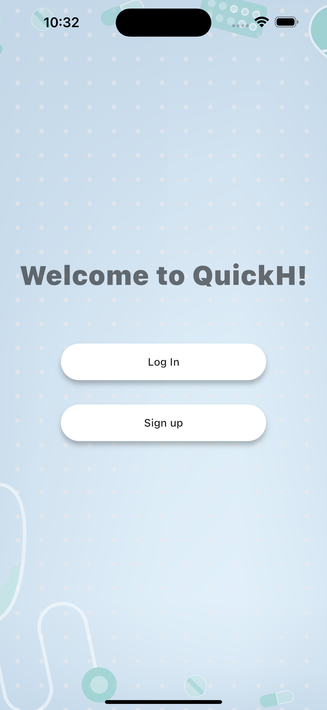
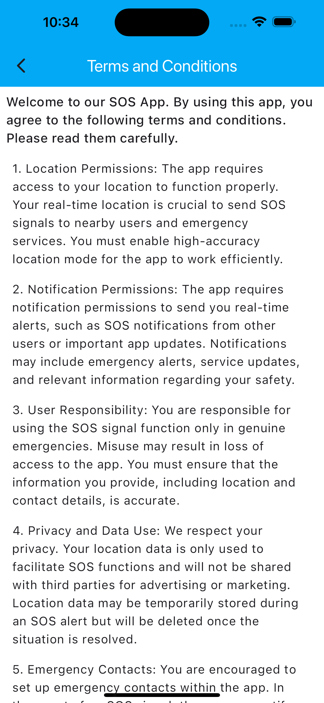
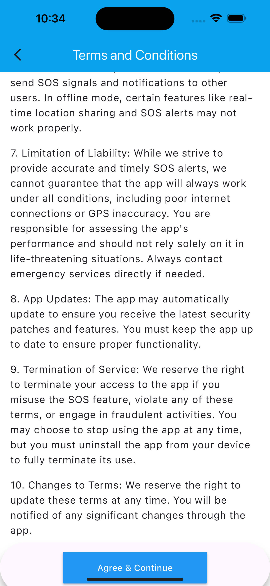
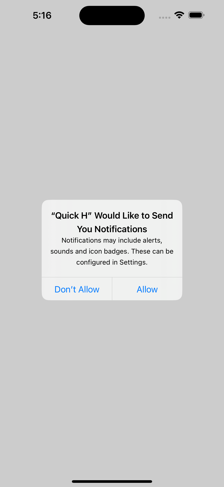
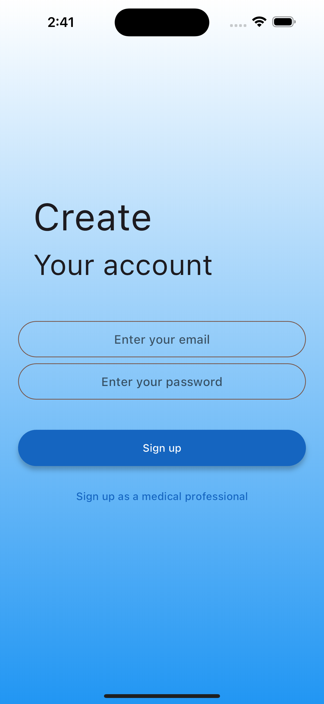
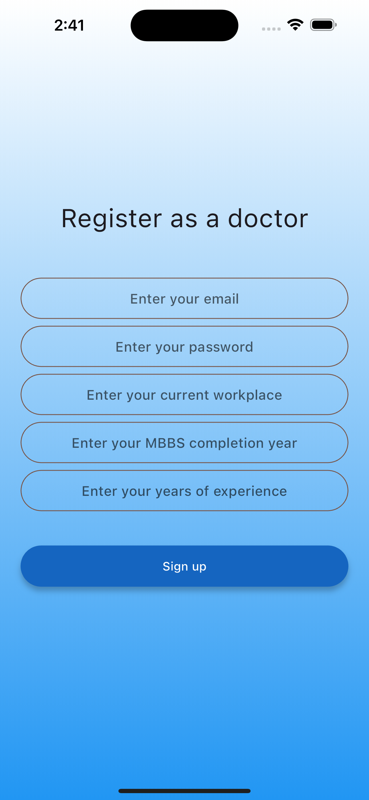
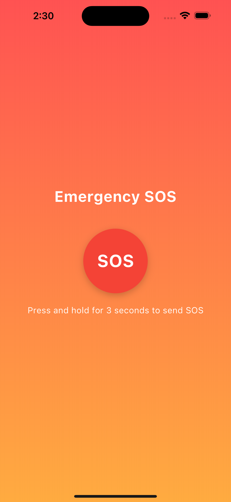
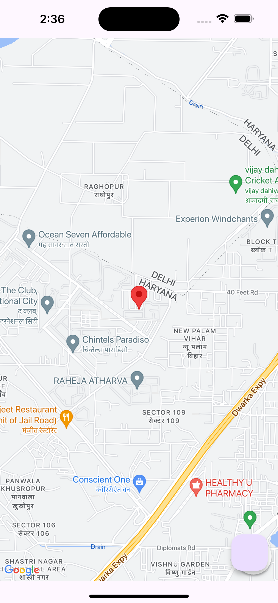

# quick_h
The app aims to provide a reliable platform for the general public to send emergency SOS signals and for medical staff to respond quickly. Users can send an SOS signal that includes their current location, obtained through the Google Maps API. This SOS notification is sent to nearby users and medical staff, facilitating quick and effective emergency responses. Utilizing Firebase Authentication, the app distinguishes between general public users and medical staff, directing them to their respective interfaces with appropriate functionalities, ensuring a tailored user experience based on their roles.

# Some instances of the app

  
  
 
 

